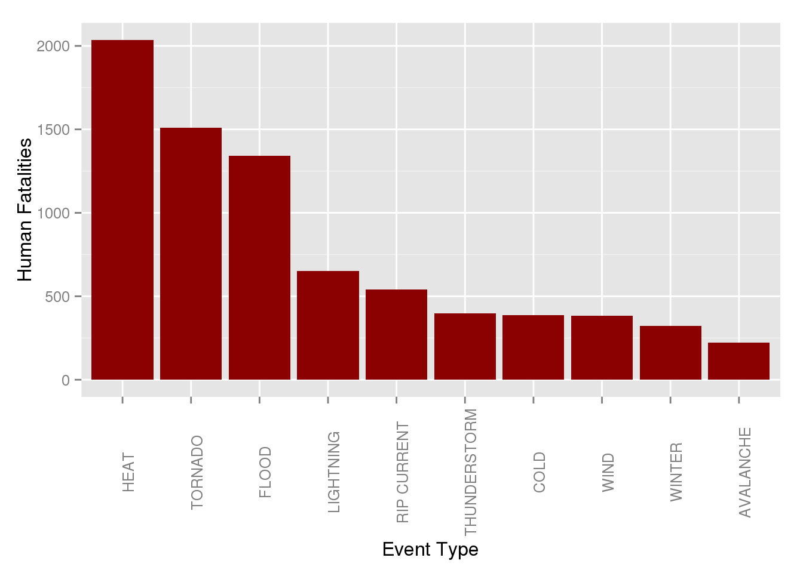
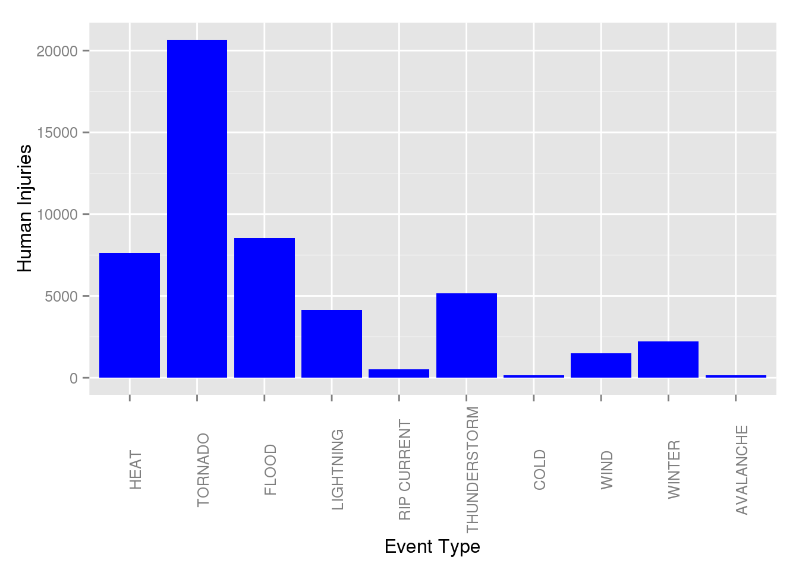
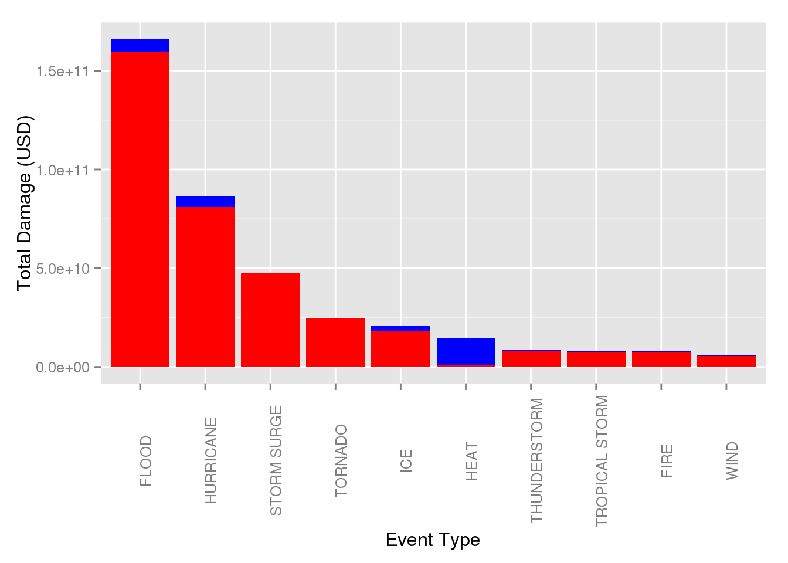

Synopsis
--------

The goal of this report is to illustrate the aggregate population and property damage caused by severe weather events between 1996 and the present. The data is sourced from the [NOAA Storm Events Database](http://www.ncdc.noaa.gov/stormevents/details.jsp) and in its raw form contains a lot of inconsistencies. The code within this presentation attempts to address some of these deficiencies through aggregation and subsetting. The end result is a graphical report on which severe weather events in the United States carry the most severe toll, whether on human population or property.

Data Processing
---------------

The raw NOAA weather data is provided in form of a bunzipped CSV \`StormData.csv.bz2'. The data is not super clean and features a lot of inconsistency for events reported prior to 1996, when recording standards become more established and data more prevalent (see [here](http://www.ncdc.noaa.gov/stormevents/details.jsp)). Constraining the dataset to only 1996 and onwards helps reduce the noise in the reporting, as does tossing out extraneous spatial information.

``` {.r}
weat_data <- read.csv("StormData.csv.bz2")
```

``` {.r}
weat_data <- within(weat_data,{
  BGN_DATE <- as.Date(BGN_DATE,"%m/%d/%Y")
  EVTYPE <- as.character(EVTYPE)
  PROPDMGEXP <- as.character(PROPDMGEXP)
  CROPDMGEXP <- as.character(CROPDMGEXP)
})
weat_data <- subset(weat_data,weat_data$BGN_DATE > as.Date("12/31/1995","%m/%d/%Y"),
                    select=c('BGN_DATE','STATE','EVTYPE','INJURIES','FATALITIES',
                             'PROPDMG','PROPDMGEXP','CROPDMG','CROPDMGEXP'))
```

The event type `EVTYPE` contains a lot of redundancy and misspellings, making it difficult to classify events and aggregate their impact. The dataset guidelines specify **48** permitted event types; the raw data has **985**. A brief round of searching through `EVTYPE` and combining like terms should bring the dataset into a bit more order.

``` {.r}
# Combine all thunderstorms
weat_data <- within(weat_data,{
  EVTYPE[grep("TORNADO",EVTYPE)] <- "TORNADO"
  EVTYPE[grep("HURRICANE|Hurricane",EVTYPE)] <- "HURRICANE"
  EVTYPE[grep("CURRENT",EVTYPE)] <- "RIP CURRENT"
  EVTYPE[grep("SURF|Surf|surf",EVTYPE)] <- "HIGH SURF"
  EVTYPE[grep("SURGE|Surge",EVTYPE)] <- "STORM SURGE"
  EVTYPE[grep("FLOOD|FLD|Flood|flood",EVTYPE)] <- "FLOOD"
  EVTYPE[grep("COAST|Coast|coast",EVTYPE)] <- "FLOOD"
  EVTYPE[grep("HEAT|DROUGHT|WARM",EVTYPE)] <- "HEAT"
  EVTYPE[grep("FREEZ|Freez|freez",EVTYPE)] <- "COLD"
  EVTYPE[grep("COLD|CHILL",EVTYPE)] <- "COLD"
  EVTYPE[grep("THUNDER|TSTM",EVTYPE)] <- "THUNDERSTORM"
  EVTYPE[grep("FOG|Fog|fog",EVTYPE)] <- "FOG"
  EVTYPE[grep("RAIN",EVTYPE)] <- "RAIN"
  EVTYPE[grep("WIND|wind|Wind",EVTYPE)] <- "WIND"
  EVTYPE[grep("ICE|Ice|Icy",EVTYPE)] <- "ICE"
  EVTYPE[grep("HAIL|Hail|hail",EVTYPE)] <- "ICE"
  EVTYPE[grep("SNOW|Snow|snow",EVTYPE)] <- "SNOW"
  EVTYPE[grep("WINT|BLIZZARD|Wint",EVTYPE)] <- "WINTER"
  EVTYPE[grep("DUST",EVTYPE)] <- "DUST"
  EVTYPE[grep("FIRE",EVTYPE)] <- "FIRE"
})
```

The heirarchy of commands was chosen to provide the least ambiguity, but as is the case with any grouping, some detail will be lost. The groupings were chosen by ranking the raw `EVTYPE` by number of fatalities and injuries and combining terms that seemed overlapping. A more-thorough cleanup should leverage smarter algorithms based off natural language processing.

The fatality and injury columns list the *number of people* killed or injured by the weather event. The dollar amounts in damage columns, however, vary in magnitude based off the prefix in the `EXP` columns. The filtering out of \<1996 data has greatly reduced the variability of `DMG` columns. 'K' means x1,000; 'M' is x1,000,000; 'B' is x1,000,000,000; empty means the value is as-is. A conversion is necessary to properly aggregate the values.

``` {.r}
weat_data <- within(weat_data,{
  PROPDMG[PROPDMGEXP == 'K'] <- PROPDMG[PROPDMGEXP == 'K']*1000
  PROPDMG[PROPDMGEXP == 'M'] <- PROPDMG[PROPDMGEXP == 'M']*1000000
  PROPDMG[PROPDMGEXP == 'B'] <- PROPDMG[PROPDMGEXP == 'B']*1000000000
  
  CROPDMG[CROPDMGEXP == 'K'] <- CROPDMG[CROPDMGEXP == 'K']*1000
  CROPDMG[CROPDMGEXP == 'M'] <- CROPDMG[CROPDMGEXP == 'M']*1000000
  CROPDMG[CROPDMGEXP == 'B'] <- CROPDMG[CROPDMGEXP == 'B']*1000000000
  
  TOTDMG <- CROPDMG + PROPDMG
})
```

With `EVTYPE` and damage amounts cleaned up, we can aggregate the event data by type to find which weather events have the greatest impact on the United States.

``` {.r}
hum_dmg <- aggregate(cbind(FATALITIES,INJURIES)~EVTYPE,weat_data,sum)
prop_dmg <- aggregate(cbind(CROPDMG,PROPDMG,TOTDMG)~EVTYPE,weat_data,sum)
```

Results
-------

The human impact of a particular weather event can be judged based off the number of fatalities and injuries associated with that particular event. Since injuries are usually recoverable, fatalities should carry more sway to the impact of an event. Let's look at the top 10 events in terms of fatalities:

``` {.r}
hum_dmg <- hum_dmg[order(-hum_dmg$FATALITIES,-hum_dmg$INJURIES)[1:10],]
hum_dmg$EVTYPE <- factor(hum_dmg$EVTYPE,levels=hum_dmg$EVTYPE,ordered=T)
```

``` {.r}
library(ggplot2)

ggplot(data=hum_dmg, aes(x=EVTYPE))+
  geom_bar(aes(y=FATALITIES),stat="identity",fill='darkred')+
  theme(axis.text.x  = element_text(angle=90))+
  ylab("Human Fatalities")+
  xlab("Event Type")
```



From the bar plot above we can see that in terms of *fatalities*, land-based events such as heat waves and tornados have the largest impact. While the `Flood` category is not subdivided into coastal, lake, or river floods, the nearby `Rip Current` group would suggest coasts are more exposed to water-related damage than inland areas. If we were to assume `Lightning`, `Wind` and `Thunderstorm` usually accompany floods, together these storm-based events would be the primary weather killers, trumping `Heat`, though `Wind` could also be cross-correlated with `Tornado`. The top-10 list is rounded out by `Cold`, `Winter` and `Avalanche`, indicating that Summer events tend to be a lot more deadly than Winter ones.

``` {.r}
ggplot(data=hum_dmg, aes(x=EVTYPE))+
  geom_bar(aes(y=INJURIES),stat='identity',fill='blue')+
  theme(axis.text.x  = element_text(angle=90))+
  ylab("Human Injuries")+
  xlab("Event Type")
```



The injury plot tells a slightly different story. `Tornado` is now the dominant event, injuring three times as many people as the next-largest group. The changes in the fatality-injury ratios are consistent with the perceived *forcefullness* of an event: tornados do a lot of damage in their path, as do thunderstorms, but they maim more ofter than they kill. `Heat` and `Cold`, however, might not bring a lot of destruction, but they tend to be highly lethal.

The property impact of an event is split amongst property damage, which inludes costs of infrastructure, and crop damage, which factors in the losses of agriculture. Since both have an economic impact measured in USD, the best measure of an event's impact is a sum of the two damages. The reported amounts have been multiplied by their exponents in the [Data Processing](#data-processing) section above. Again, let's look at top-10 most damaging weather events:

``` {.r}
prop_dmg <- prop_dmg[order(-prop_dmg$TOTDMG)[1:10],]
prop_dmg$EVTYPE <- factor(prop_dmg$EVTYPE,levels=prop_dmg$EVTYPE,ordered=T)
```

``` {.r}
ggplot(data=prop_dmg, aes(x=EVTYPE))+
  geom_bar(aes(y=TOTDMG),stat='identity',fill='blue')+
  geom_bar(aes(y=PROPDMG),stat='identity',fill='red')+
  theme(axis.text.x  = element_text(angle=90))+
  ylab("Total Damage (USD)")+
  xlab("Event Type")
```



The red bars are the cost associated with Property Damage while the blue is the Crop Damage cost (remainder from the Total Damage). As we can see, the vast bulk of the cost is infrastructure related and dominated by water-related events. There is a possibility of outliers due to data entry errors, but even removing the top three costliest events retains the trend seen in the plot above. Heat is the only damaging event in the top-10 which has a much higher crop cost than property cost. That observation is unsurprising since of all the event types in plot, it is the only one that is not associated with a significant force.

This concludes the foray into understanding the societal and economic impacts of severe weather events in the United States.
