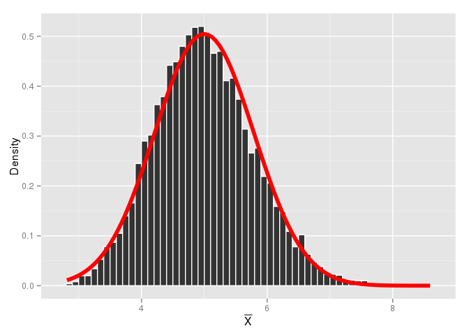

# Statistical Inference: Project 1
Eugene Yedvabny  


## Question 1: Statistics of Exponential Distributions

The goal of this simulation is to sample the exponential distribution with $\lambda=0.2$. The sample size is set to $n=40$ and the number of samples is chosen sufficiently large to approach the asymptote.


```r
n <- 40 # Number of elements per sample
nosim <- 10000 # Number of samples
lambda <- 0.2 # The rate of exponential distribution

# Simulate the data and compute the means of each sample
sim.data <- matrix(rexp(n*nosim,lambda),nosim)
sim.means <- apply(sim.data,1,mean)
sim.sds <- apply(sim.data,1,sd)

# Collect stats on the sample distribution
sim.mean <- mean(sim.means)
sim.sem <- sd(sim.means)
```

Under CLT the sampling of even an _exponential_ distribution will be roughly normal, with $\bar{X}=\mu$ and $SE=\sigma/\sqrt{n}$. Since in the exponential distribution $\mu=\sigma=1/\lambda$ we should expect $\bar{X} \simeq 1/(0.2) = 5$ and $SE \simeq 1/(0.2)/\sqrt{40} = 0.791$.

 

As the above figure illustrates, the histogram roughly fits under the normal curve with aformentioned properties. The specific mean and standard deviation of the simulation vs population is presented in the table below.


            Simulation    Population 
---------  ------------  ------------
$\mu$         4.999         5.000    
$\sigma$      0.789         0.791    

In evaluating the coverage, we are looking for a 95% $\mu$ CI defined by $\bar{X}\pm1.96\sigma/\sqrt{n} = 1/\lambda\pm1.96(1/\lambda\sqrt{n})$. With $\lambda=0.2$ and $n=40$ that translates to $5\pm1.55$ for an ideally normal distribution. Now, since in most cases we _won't_ have a known population mean, I am going to use the Standard Error of Mean as the estimate for $\sigma/\sqrt{n}$. 


```r
ll <- sim.means - qnorm(.975) * sim.sem
ul <- sim.means + qnorm(.975) * sim.sem
coverage <- mean(ll < 1/lambda & ul > 1/lambda)
```

The CI coverage of this simulation is 94.97%, which is very close to the ideal 95%.
