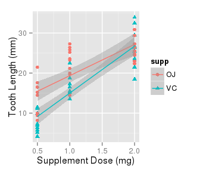
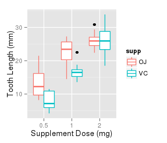

# Statistical Inference: Project 1
Eugene Yedvabny  


## Question 2: Statistics of the ToothGrowth Dataset


```r
data(ToothGrowth)
```

The dataset we're asked to analyze is titled __The Effect of Vitamin C on Tooth Growth in Guinea Pigs__ and contains three fields: numeric _len_ for tooth length, factor _supp_ for two types of supplement (VC for Ascorbic Acid or OJ for Orange Juice), and numeric _dose_ for the dose in milligrams. The dataset contains 60 observations: 10 guinea pigs x 2 delivery methods x 3 dosage values.

  

We can see that there's indeed a growth pattern between the dosage of vitamin C administered and the size of the teeth. It's a lot harder to establish whether the _delivery_ method for the vitamin has any impact on the results.

Let's work under the assumption that the observed guinea pigs were randomly taken from the overall population, so that the _population_ variance is the same and we can apply a t-test. A cursory glance through the teeth lengths suggests that the samples of guiney pigs are independent, and so we should be using _unpaired_ testing.

The __null hypothesis__ for this experiment is that the delivery method has no impact, e.g., the confidence interval for the difference in two samples should include 0.


```r
vc_5 <- filter(ToothGrowth,dose==0.5 & supp=='VC')$len
vc_10 <- filter(ToothGrowth,dose==1.0 & supp=='VC')$len
vc_20 <- filter(ToothGrowth,dose==2.0 & supp=='VC')$len

oj_5 <- filter(ToothGrowth,dose==0.5 & supp=='OJ')$len
oj_10 <- filter(ToothGrowth,dose==1.0 & supp=='OJ')$len
oj_20 <- filter(ToothGrowth,dose==2.0 & supp=='OJ')$len

t.test(vc_5, oj_5, conf.level=0.95, var.equal=TRUE)
```

```
## 
## 	Two Sample t-test
## 
## data:  vc_5 and oj_5
## t = -3.1697, df = 18, p-value = 0.005304
## alternative hypothesis: true difference in means is not equal to 0
## 95 percent confidence interval:
##  -8.729738 -1.770262
## sample estimates:
## mean of x mean of y 
##      7.98     13.23
```

```r
t.test(vc_10,oj_10,conf.level=0.95, var.equal=TRUE)
```

```
## 
## 	Two Sample t-test
## 
## data:  vc_10 and oj_10
## t = -4.0328, df = 18, p-value = 0.0007807
## alternative hypothesis: true difference in means is not equal to 0
## 95 percent confidence interval:
##  -9.019308 -2.840692
## sample estimates:
## mean of x mean of y 
##     16.77     22.70
```

```r
t.test(vc_20,oj_20,conf.level=0.95, var.equal=TRUE)
```

```
## 
## 	Two Sample t-test
## 
## data:  vc_20 and oj_20
## t = 0.0461, df = 18, p-value = 0.9637
## alternative hypothesis: true difference in means is not equal to 0
## 95 percent confidence interval:
##  -3.562999  3.722999
## sample estimates:
## mean of x mean of y 
##     26.14     26.06
```

As we can see from the above p-values and confidence intervals, the two delivery mechanism yield different means for 0.5 and 1.0 mg doses, allowing us to reject the null hypothesis. For the 2.0 mg dose the CI includes 0, so the difference in the mechanisms is insignificant.
